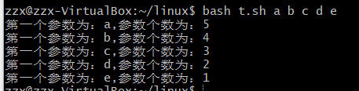

# 第四章：shell脚本编程基础

## task1:

* 任务一：用bash编写一个图片批处理脚本，实现以下功能：
     *  支持命令行参数方式使用不同功能
     *  支持对指定目录下所有支持格式的图片文件进行批处理
      *  支持以下常见图片批处理功能的单独使用或组合使用
         
          * 支持对`jpeg`格式图片进行图片质量压缩
          
            `bash photo.sh -d photo -q 50`
          
           * 支持对`jpeg/png/svg`格式图片在保持原始宽高比的前提下压缩分辨率
          
             `bash photo.sh -d photo -r 50%50`
          
          * 支持对图片批量添加自定义文本水印
          
            `bash photo.sh -d photo -w "hello"`
          
          * 支持批量重命名（统一添加文件名前缀或后缀，不影响原始文件扩展名）
          
            前缀：`bash job4/img.sh -d job4/img --prefix "2222"`
          
            后缀：`bash job4/img.sh -d job4/img --postfix "2222"`
          
          * 支持将`png/svg`图片统一转换为`jpg`格式图片、
          
            `bash photo.sh -d photo -c`

* 使用的工具

  - imagemagick : convert

    

### 总结

1.  convert图像处理命令

    -quality -% -.jpg（处理图像） -.jpg（输出图像） 

    -resize - -.jpg（处理图像） -.jpg（输出图像） 

    -fill white -pointsize 40 -draw 'text 10,50 hello'

2. getopt命令可以接受一系列任意形式的命令行选项和参数，并自动将它们转换成适当的格式。格式如下：

   ` getopt optstring parameters `

   - getopt 工作实例

     ```shell
     #getopt ab:cd -a -b test1 -cd test2 test3
      -a -b test1 -c -d -- test2 test3
     ```

     

     **optstring定义了四个有效选项字母:a,b,c,d.冒号（：）被放在了字母b后面，因为b选项需要一个参数值，当getopt命令运行时，它会检查提供的参数列表（-a -b test1 -cd test2 test3），并给予提供的optstring进行解析，它会自动讲-cd选项分成两个单独的选项，并插入双破折线来分割行中的额外参数。**

     关于参数：对于getopt: 单冒号必须带参数，可以加空格，也可以不加；双冒号必须带参数，且不能加空格 

3. eval命令

    eval会对命令行进行2次扫描，第一次进行变量替换，第二次再执行变量替换后的命令行 

4. 查看图片大小`indentify`：


2. shift命令用于对参数的移动（左移），通常用于再不知道传入参数的情况下遍历每一个参数然后进行相应的处理

   - 例如：

     ```shell
     #!/usr/bin/env bash
     
     while [ $# != 0 ];do
     echo "第一个参数为：$1,参数个数为：$#"
     shift
     done
     ```

   ​	 	输入如下命令运行：run.sh a b c d e f 

    		结果：

   


## task2:

- 任务二：用bash编写一个文本批处理脚本，对以下附件分别进行批量处理完成相应的数据统计任务： 

* 2014世界杯运动员数据
  * 统计不同年龄区间范围（20岁以下、[20-30]、30岁以上）的球员**数量**、**百分比**
  * 统计不同场上位置的球员**数量**、**百分比**
  * 名字最长的球员是谁？名字最短的球员是谁？
  * 年龄最大的球员是谁？年龄最小的球员是谁？

* 使用工具：
  - awk(文本分析工具)

### 总结

* **bc命令**是一种支持任意精度的交互执行的计算器语言。bash内置了对整数四则运算的支持，但是并不支持浮点运算，而bc命令可以很方便的进行浮点运算，当然整数运算也不再话下。

* [awk分隔符]( https://www.zsythink.net/archives/1357 ) 

* **shell脚本中大于，大于等于，小于，小于等于、不等于的表示方法**

  症状：shell中大于，大于等于，小于等于，lt,gt ,ne,ge,le 很对应。

  应对方法：

  大于 -gt (greater than)
  小于 -lt (less than)
  大于或等于 -ge (greater than or equal)
  小于或等于 -le (less than or equal)
  不相等 -ne （not equal）

* 注意空格  `      		if [ "$pos" == 'Defender' ]; then `每个字符都要有空格
* 在赋值的时候与等号间不能有空格
* 统计名字长度的时候，因为名字间有空格，需要把数组转换一下


## task3

任务三：用bash编写一个文本批处理脚本，对以下附件分别进行批量处理完成相应的数据统计任务： 

- Web服务器访问日志
  - 统计访问来源主机TOP 100和分别对应出现的总次数
  - 统计访问来源主机TOP 100 IP和分别对应出现的总次数
  - 统计最频繁被访问的URL TOP 100
  - 统计不同响应状态码的出现次数和对应百分比
  - 分别统计不同4XX状态码对应的TOP 10 URL和对应出现的总次数
  - 给定URL输出TOP 100访问来源主机


**几个点：**

* 解压.7z文件：
  1. 安装apt-get install p7zip Z	
  2. 还是没有解压好


## 参考

[awk](http://www.zsythink.net/archives/1336)

[getopt和getopts的使用]( https://blog.csdn.net/wh211212/article/details/53750366 )

[linux shell 中的eval]( https://blog.csdn.net/damotiansheng/article/details/39735441 )

[linux-2019-jackcily]( https://github.com/CUCCS/linux-2019-jackcily )

