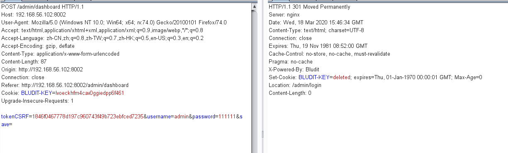
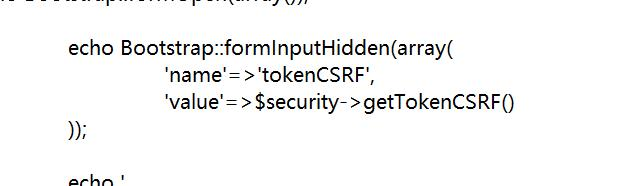
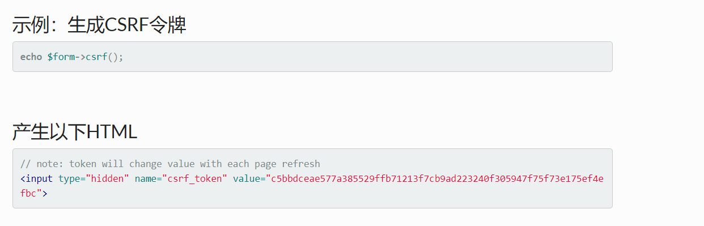
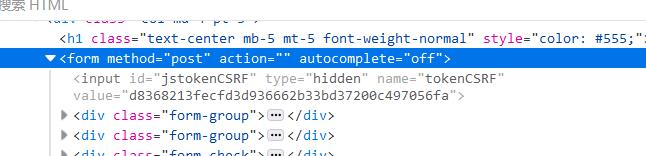

# 数据填充

### 需要填充的数据

下载、注册、登录和增加用户

- 下载和注册

  本来是想在使用docker构建镜像的时候完成这两项数据填充。构建的过程中确实是运行了这个.sh文件但是没有起到效果，我在容器里重新跑这个脚本就可以执行成功。不知道原因？？

  

- 登录和添加用户：在请求中有`csrftoken`字段

  一开始计划是用`curl`来模拟点击实现登录，写的`shell`脚本就时而可以登录时而不可以登录，通过`burpsuit`重放测试发现请求只有第一次可以请求成功

  

  `csrftoken`字段每一次请求都会变化。通过搜索查询，csrftoken生成有两种可能的方式：

  1. 找到源码种生成token的方式伪造token

  2. 函数可以自动生成一个隐藏的标签

  通过查看源码，是第二种生成方式

  

  

  

### 填充数据检测

- 检测方法：新增用户可以正常登录视为数据填充成功，不知道这个检测方法可不可以？？

# exp/poc脚本

- 已经存在的用户登录，然后上传`.php`文件